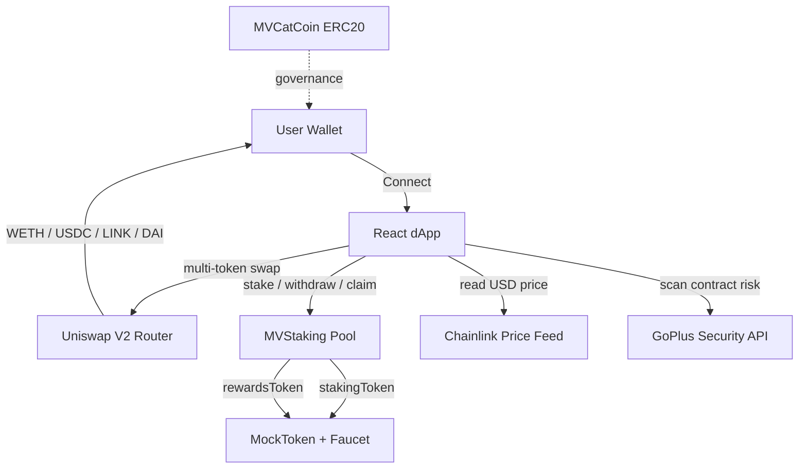

# MVCatCoin

[](https://github.com/wowasoy/mvcatcoin/actions/workflows/ci.yml)
[](https://github.com/wowasoy/mvcatcoin/actions)
[](LICENSE)
[](https://soliditylang.org/)
[](https://getfoundry.sh/)
[](https://www.typescriptlang.org/)

**Live demo:** https://mvcatcoin.pages.dev

A full-stack Web3 demonstration project featuring a production-grade ERC-20 token, a staking pool, a mock ERC-20 with public faucet, a multi-token swap interface on Uniswap V2, Chainlink price feeds, and an integrated token safety scanner powered by GoPlus Security.

---

## Overview

MVCatCoin demonstrates a complete Web3 development stack across four smart contracts and a modern React dApp. It is intended as a portfolio piece and educational reference, **not as a financial product**.

The project is deployed on the **Ethereum Sepolia testnet only**. No real value is at stake.

## Tech Stack

| Layer | Technology | Version |
|---|---|---|
| Smart contracts | Solidity | 0.8.30 |
| Contract framework | Foundry | 1.5.0 |
| Contract library | OpenZeppelin Contracts | 5.3.0 |
| Price oracle | Chainlink Price Feeds | — |
| Token scanner | GoPlus Security API | — |
| Frontend | React + TypeScript | 19 / 5.6 |
| Bundler | Vite | 6 |
| Web3 client | Viem + Wagmi | 2.21 / 2.14 |
| Data fetching | TanStack Query | 5 |
| Notifications | Sonner | 1.7 |
| Hosting | Cloudflare Pages | — |

## Architecture



## Contracts

### MVCatCoin — `contracts/MVCatCoin.sol`

- ERC-20 with a maximum cap of 1,000,000,000 MVCAT
- Initial supply: 500,000,000 MVCAT minted to treasury at deploy
- Remaining 500,000,000 MVCAT mintable by `MINTER_ROLE`
- `ERC20Permit` for gasless approvals
- `ERC20Votes` for on-chain governance
- `ERC20Burnable`
- `AccessControl` with `MINTER_ROLE`
- Custom error `ZeroAddress`

### MVStaking — `contracts/MVStaking.sol`

- `rewardPerToken` accumulator pattern
- `ReentrancyGuard` on state-changing entry points
- `Ownable2Step` for two-step ownership transfer
- Configurable `rewardRate` by owner
- `recoverERC20` with staking-token protection

### MockToken — `contracts/MockToken.sol`

- Test ERC-20 with a public `faucet()`
- 1,000 tokens per claim, 24-hour cooldown per address
- Custom error `FaucetCooldown(uint256 secondsRemaining)`

## Frontend Features

- **Multi-token swap** — ETH, WETH, USDC, LINK, DAI, USDT on Sepolia via Uniswap V2
- **Chainlink USD pricing** — real-time oracle-based USD reference for ETH/WETH
- **Token safety scanner** — GoPlus-powered risk scan for any ERC-20 address
- **Market ticker** — dual-row animated marquee with baseline prices (demo data)
- **Staking UI** — stake / withdraw / claim with live stats
- **Faucet button** — claims test tokens for demo
- **Wallet connect** — via wagmi (MetaMask, Rabby, OKX, Trust, Coinbase)
- **Token picker modal** — bottom-sheet UI with SVG icons
- **Live quotes** — auto-fetched from Uniswap router as you type
- **MAX button** — auto-fills balance, reserves gas for native ETH
- **Etherscan links** — every transaction is linkable
- **Toast notifications** — via Sonner
- **Sidebar drawer** — About, Utility, Project Info, Security Warning
- **Liquid glass UI** — black-green theme, mobile-first, responsive

## Quickstart

```bash
git clone https://github.com/wowasoy/mvcatcoin.git
cd mvcatcoin
forge install foundry-rs/forge-std --no-git --no-commit
forge install OpenZeppelin/openzeppelin-contracts --no-git --no-commit
forge build
forge test
```

## Testing

```bash
forge test -vvv
forge coverage
```

The suite includes unit tests, fuzz tests, and revert-path tests for both `MVCatCoin` and `MVStaking`.

## Deployment

### 1. Configure environment

```bash
cp .env.example .env
# Edit .env: ADMIN_ADDRESS, TREASURY_ADDRESS, INITIAL_SUPPLY, SEPOLIA_RPC_URL, PRIVATE_KEY
```

### 2. Deploy

```bash
source .env

# Option A — real MVCatCoin
forge script script/DeployMVCatCoin.s.sol --rpc-url $SEPOLIA_RPC_URL --broadcast --verify

# Option B — mock stack (MockToken + MVStaking in one run)
forge script script/DeployMockStack.s.sol --rpc-url $SEPOLIA_RPC_URL --broadcast
```

### 3. Update frontend addresses

Copy the deployed addresses into `frontend/src/contracts.ts` under `DEPLOYMENTS[sepolia.id]`.

## Frontend

```bash
cd frontend
npm install
npm run dev
```

### Deploy to Cloudflare Pages

| Setting | Value |
|---|---|
| Framework preset | Vite |
| Root directory | `frontend` |
| Build command | `npm install && npm run build` |
| Build output directory | `dist` |
| Environment variable | `NODE_VERSION=22` |

## Project Structure

```
mvcatcoin/
├── contracts/
│   ├── MVCatCoin.sol          ERC-20 governance token
│   ├── MVStaking.sol          Reward pool
│   └── MockToken.sol          Test ERC-20 with public faucet
├── script/
│   ├── DeployMVCatCoin.s.sol
│   ├── DeployMVStaking.s.sol
│   └── DeployMockStack.s.sol  Deploy mock + staking in one run
├── test/
│   ├── MVCatCoin.t.sol
│   └── MVStaking.t.sol
├── frontend/
│   ├── functions/api/         Cloudflare Pages Functions (proxy)
│   ├── src/
│   │   ├── components/        UI components
│   │   ├── hooks/             Custom React hooks
│   │   ├── styles/            CSS
│   │   ├── abi.ts             Contract ABIs
│   │   ├── chainlink.ts       Chainlink feed config
│   │   ├── contracts.ts       Deployment registry
│   │   ├── tokens.ts          Sepolia token list
│   │   ├── wagmi.ts           Wagmi config
│   │   └── main.tsx           Entry point
│   └── public/                Static assets, headers, robots.txt
└── .github/workflows/ci.yml   CI pipeline
```

## Security Practices

- OpenZeppelin Contracts v5.3.0 (audited library)
- Solidity 0.8.30 with built-in overflow checks
- `ReentrancyGuard` on all state-changing entry points
- `Ownable2Step` for safe ownership transfer
- Custom errors instead of revert strings
- Role-based access control
- Fuzz testing via Foundry
- Token safety scanning via GoPlus Security

## Third-Party Services and Attribution

This project integrates the following third-party services, each used in accordance with their respective terms.

### Chainlink Price Feeds

- **Purpose:** On-chain USD price reference for ETH/WETH
- **Terms:** Chainlink data feeds are provided under the [Chainlink Terms of Service](https://chain.link/terms)
- **Attribution:** Chainlink® is a trademark of Chainlink Foundation
- **Network:** Ethereum Sepolia testnet

### GoPlus Security API

- **Purpose:** Token risk scanning (honeypot, taxes, ownership flags)
- **Terms:** Used under the [GoPlus API License Agreement](https://docs.gopluslabs.io/reference/api-license-agreement-new)
- **License grant:** Irrevocable, non-exclusive, royalty-free, sublicensable
- **Attribution:** "Powered by Go+ Security" is displayed in the UI
- **Rate limit:** Free tier, 100 requests per minute

### Uniswap V2

- **Purpose:** Multi-token swap routing on Sepolia
- **Terms:** Uniswap V2 protocol is open source under GPL-3.0
- **Attribution:** Uniswap® is a trademark of Universal Navigation Inc.

### OpenZeppelin Contracts

- **Purpose:** Audited implementations of ERC-20, AccessControl, ReentrancyGuard, and related primitives
- **License:** MIT
- **Attribution:** OpenZeppelin Contracts © OpenZeppelin

### CoinMarketCap Baseline Data

- **Purpose:** Static reference values for the demo market ticker
- **Nature:** The ticker uses hardcoded baseline values, not a live API integration
- **Attribution:** Baseline price references sourced from publicly displayed CoinMarketCap data, October 2026
- **Note:** This is demo data for visual demonstration only

## Legal Disclaimer

**MVCatCoin is a portfolio demonstration project. Read this carefully before interacting.**

1. **Testnet only.** All contracts are deployed on the Ethereum Sepolia testnet. Testnet tokens have **no monetary value** and cannot be exchanged for any asset.

2. **Not audited.** The smart contracts in this repository have **not been audited** by an external security firm. They are provided "as is" for educational purposes.

3. **Not financial advice.** Nothing in this repository, its documentation, or the live application constitutes financial, investment, legal, or tax advice.

4. **Not a security.** MVCatCoin is not registered as a security in any jurisdiction. It is not intended for investment, speculation, or trading.

5. **No warranty.** The authors and contributors disclaim all warranties, express or implied, including merchantability and fitness for a particular purpose.

6. **Use at your own risk.** You are solely responsible for any interaction with the deployed contracts and applications.

7. **Third-party services.** Chainlink, GoPlus, Uniswap, and OpenZeppelin are independent third parties. This project makes no claims about their services beyond what is documented here.

8. **Trademarks.** All product names, logos, and brands are the property of their respective owners. Their use in this project is for identification and attribution only.

## Contact

Telegram: [t.me/MVrocketRuns](https://t.me/MVrocketRuns)

## License

Source code in this repository is released under the MIT License. See [LICENSE](LICENSE) for the full text.

Third-party services, trademarks, and data references remain the property of their respective owners and are used under their own terms.