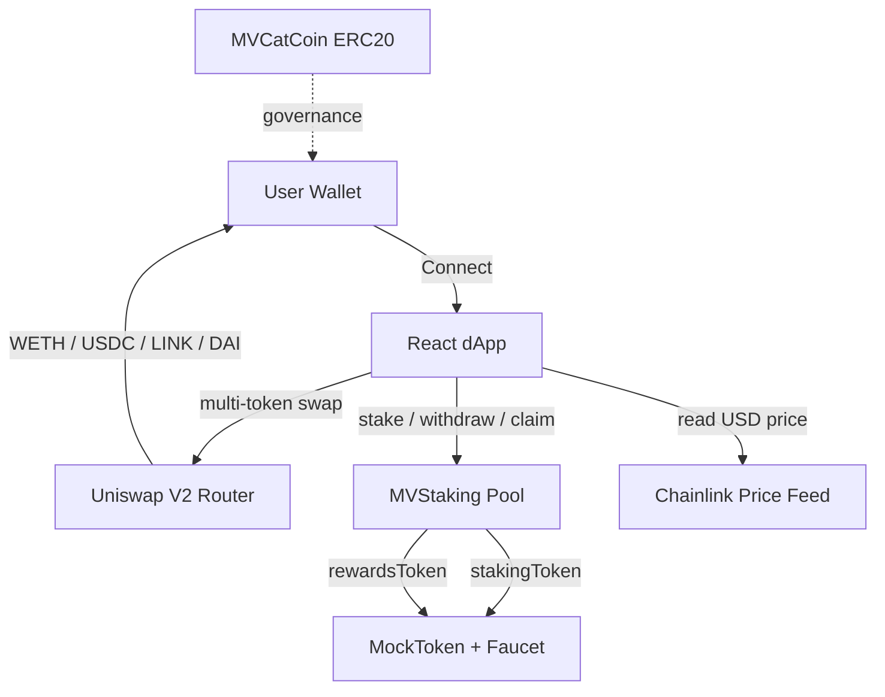

# MVCatCoin

[](https://github.com/wowasoy/mvcatcoin/actions/workflows/ci.yml)
[](https://github.com/wowasoy/mvcatcoin/actions)
[](LICENSE)
[](https://soliditylang.org/)
[](https://getfoundry.sh/)
[](https://www.typescriptlang.org/)

**Live demo:** https://mvcatcoin.pages.dev

A full-stack Web3 demo project with a production-grade ERC20 token, a staking pool, a mock token with public faucet, a multi-token swap interface on Uniswap V2, and a Chainlink price feed integration for real-time USD quotes.

---

## Overview

MVCatCoin demonstrates a complete Web3 stack across four contracts and a React dApp:

- **MVCatCoin** — the governance ERC20 (capped, permit, burnable, votes)
- **MVStaking** — a time-based staking pool using the reward-per-token accumulator pattern
- **MockToken** — an ERC20 with a public `faucet()` for testnet demos
- **React dApp** — multi-token swap, staking UI, and real-time USD pricing

The project is currently deployed on **Sepolia testnet** and serves as a portfolio piece demonstrating contract authoring, testing, frontend integration, and DeFi primitives.

## Tech Stack

| Layer | Technology | Version |
|---|---|---|
| Smart contracts | Solidity | 0.8.30 |
| Contract framework | Foundry | 1.5.0 |
| Contract library | OpenZeppelin Contracts | 5.3.0 |
| Oracle | Chainlink Price Feeds | — |
| Frontend | React + TypeScript | 19 / 5.6 |
| Bundler | Vite | 6 |
| Web3 client | Viem + Wagmi | 2.21 / 2.14 |
| Data fetching | TanStack Query | 5 |
| Notifications | Sonner | 1.7 |
| Hosting | Cloudflare Pages | — |

## Architecture



### Contract Details

**MVCatCoin** — `contracts/MVCatCoin.sol`

- ERC20 with capped supply of 1,000,000,000 MVCAT
- `ERC20Permit` for gasless approvals
- `ERC20Votes` for on-chain governance
- `ERC20Burnable`
- `AccessControl` with `MINTER_ROLE`
- Custom error `ZeroAddress`

**MVStaking** — `contracts/MVStaking.sol`

- `rewardPerToken` accumulator pattern
- `ReentrancyGuard` on state-changing entry points
- `Ownable2Step` for ownership transfer
- Configurable `rewardRate` by owner
- `recoverERC20` with staking-token protection

**MockToken** — `contracts/MockToken.sol`

- Test ERC20 with public `faucet()`
- 1,000 tokens per claim, 24-hour cooldown
- Custom error `FaucetCooldown(uint256 secondsRemaining)`

## Frontend Features

- **Multi-token swap** — ETH, WETH, USDC, LINK, DAI, USDT on Sepolia via Uniswap V2
- **Custom SVG token icons** — brand-accurate logos rendered inline
- **Real-time USD pricing** — Chainlink ETH/USD price feed, refreshed every 30s
- **Token picker modal** — bottom-sheet UI with search-ready layout
- **Live quote** — auto-fetched from the Uniswap router as you type
- **MAX button** — auto-fills balance, reserves gas for native ETH
- **Approval flow** — detects allowance and prompts approve before swap
- **Staking UI** — stake / withdraw / claim with live stats (balance, staked, earned)
- **Faucet button** — claims mock tokens for demo
- **Etherscan links** — every transaction is linkable
- **Toast notifications** — success, error, and info states via Sonner
- **Liquid glass UI** — black-green theme, animated orbs, mobile-first responsive

## Quickstart

```bash
git clone https://github.com/wowasoy/mvcatcoin.git
cd mvcatcoin
forge install foundry-rs/forge-std --no-git --no-commit
forge install OpenZeppelin/openzeppelin-contracts --no-git --no-commit
forge build
forge test
```

## Testing

```bash
forge test -vvv
forge coverage
```

The suite includes unit tests, fuzz tests, and revert-path tests for both `MVCatCoin` and `MVStaking`.

## Deployment

### 1. Configure environment

```bash
cp .env.example .env
# Edit .env: ADMIN_ADDRESS, TREASURY_ADDRESS, INITIAL_SUPPLY, SEPOLIA_RPC_URL, PRIVATE_KEY
```

### 2. Deploy token + staking stack

```bash
source .env

# Option A: real MVCatCoin (production path)
forge script script/DeployMVCatCoin.s.sol --rpc-url $SEPOLIA_RPC_URL --broadcast --verify

# Option B: mock token + staking (testnet demo path)
forge script script/DeployMockStack.s.sol --rpc-url $SEPOLIA_RPC_URL --broadcast
```

### 3. Update frontend addresses

Copy contract addresses into `frontend/src/contracts.ts` under `DEPLOYMENTS[sepolia.id]`.

## Frontend

```bash
cd frontend
npm install
npm run dev
```

### Deploy to Cloudflare Pages

| Setting | Value |
|---|---|
| Framework preset | Vite |
| Root directory | `frontend` |
| Build command | `npm install && npm run build` |
| Build output directory | `dist` |
| Environment variable | `NODE_VERSION=22` |

## Project Structure

```
mvcatcoin/
├── contracts/
│   ├── MVCatCoin.sol          ERC20 governance token
│   ├── MVStaking.sol          Reward pool
│   └── MockToken.sol          Test ERC20 with faucet
├── script/
│   ├── DeployMVCatCoin.s.sol
│   ├── DeployMVStaking.s.sol
│   └── DeployMockStack.s.sol  Deploy mock + staking in one go
├── test/
│   ├── MVCatCoin.t.sol
│   └── MVStaking.t.sol
├── frontend/
│   ├── src/
│   │   ├── components/
│   │   │   ├── Header.tsx
│   │   │   ├── Logo.tsx
│   │   │   ├── WalletCard.tsx
│   │   │   ├── TokenInfoCard.tsx
│   │   │   ├── SwapCard.tsx
│   │   │   ├── StakingCard.tsx
│   │   │   ├── TokenIcons.tsx      Inline SVG icons
│   │   │   └── PriceDisplay.tsx    Chainlink USD wrapper
│   │   ├── hooks/
│   │   │   └── usePrice.ts         Chainlink price hook
│   │   ├── styles/
│   │   │   └── main.css
│   │   ├── abi.ts
│   │   ├── chainlink.ts            Feed addresses + ABI
│   │   ├── contracts.ts            Deployment registry
│   │   ├── tokens.ts               Sepolia token list
│   │   ├── wagmi.ts
│   │   └── main.tsx
│   └── public/
└── .github/workflows/ci.yml
```

## Security

See [SECURITY.md](SECURITY.md) for the disclosure policy and scope.

Best practices applied:

- OpenZeppelin Contracts v5.3.0 (audited)
- Solidity 0.8.30 with built-in overflow checks
- `ReentrancyGuard` on state-changing entry points
- `Ownable2Step` for safe ownership transfer
- Custom errors instead of require strings
- Role-based access control
- Fuzz testing via Foundry
- Chainlink oracle for price accuracy

## Notes on Testnet Demo

The Sepolia demo uses **mock tokens** with a public faucet. USD prices come from **Chainlink Sepolia feeds** which track mainnet markets — not from the thin Sepolia Uniswap pools. This is the recommended setup for accurate demo pricing.

## Contact

Telegram: [t.me/MVrocketRuns](https://t.me/MVrocketRuns)

## License

MIT. See [LICENSE](LICENSE).