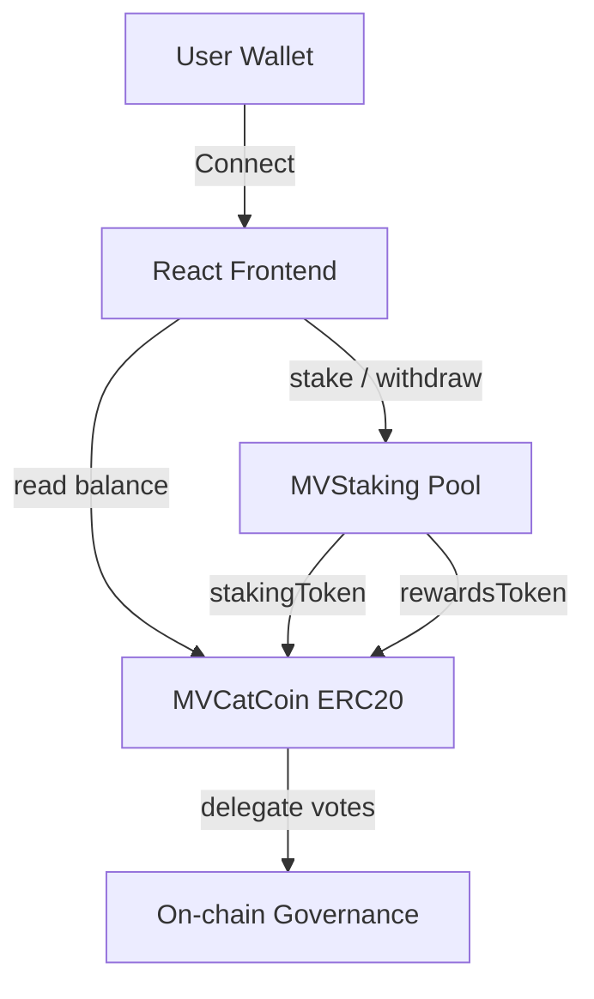

# MVCatCoin

[](https://github.com/wowasoy/mvcatcoin/actions/workflows/ci.yml)
[](https://github.com/wowasoy/mvcatcoin/actions)
[](LICENSE)
[](https://soliditylang.org/)
[](https://getfoundry.sh/)
[](https://www.typescriptlang.org/)

**Live demo:** https://mvcatcoin.pages.dev

Production-grade ERC20 governance token with a companion staking pool and a TypeScript dApp dashboard. Built with Foundry, OpenZeppelin Contracts v5, and React + wagmi.

---

## Overview

MVCatCoin is a two-contract system:

- **MVCatCoin** — an ERC20 token with capped supply, permit, burnable, and on-chain voting
- **MVStaking** — a time-based staking pool distributing rewards proportionally

The project demonstrates a complete Web3 stack: contract authoring, testing, deployment scripting, CI/CD, and frontend integration.

## Tech Stack

| Layer | Technology | Version |
|---|---|---|
| Smart contracts | Solidity | 0.8.30 |
| Contract framework | Foundry | 1.5.0 |
| Contract library | OpenZeppelin Contracts | 5.3.0 |
| Frontend | React + TypeScript | 19 / 5.6 |
| Bundler | Vite | 6 |
| Web3 client | Viem + Wagmi | 2.21 / 2.14 |
| Data fetching | TanStack Query | 5 |
| Hosting | Cloudflare Pages | — |

## Architecture



### Contract Details

**MVCatCoin** (`contracts/MVCatCoin.sol`)

- ERC20 with capped supply of 1,000,000,000 MVCAT
- `ERC20Permit` for gasless approvals
- `ERC20Votes` for on-chain governance
- `ERC20Burnable` for supply reduction
- `AccessControl` with `MINTER_ROLE` for controlled minting
- Custom error `ZeroAddress` instead of require strings

**MVStaking** (`contracts/MVStaking.sol`)

- `rewardPerToken` accumulator pattern for efficient reward distribution
- `ReentrancyGuard` on all state-changing entry points
- `Ownable2Step` for two-step ownership transfer
- Configurable `rewardRate` by owner
- `recoverERC20` with protection for staking token

## Quickstart

```bash
git clone https://github.com/wowasoy/mvcatcoin.git
cd mvcatcoin
forge install foundry-rs/forge-std --no-git --no-commit
forge install OpenZeppelin/openzeppelin-contracts --no-git --no-commit
forge build
forge test
```

## Testing

Run the full test suite:

```bash
forge test -vvv
```

Run coverage:

```bash
forge coverage
```

The suite includes unit tests, fuzz tests, and revert-path tests for both contracts.

## Deployment

### 1. Configure environment

```bash
cp .env.example .env
# Edit .env with your admin address, treasury address, and RPC URL
```

### 2. Deploy

```bash
source .env
forge script script/DeployMVCatCoin.s.sol --rpc-url $SEPOLIA_RPC_URL --broadcast --verify
```

### 3. Staking (optional)

```bash
forge script script/DeployMVStaking.s.sol --rpc-url $SEPOLIA_RPC_URL --broadcast --verify
```

## Frontend

The `frontend/` directory contains a React dApp dashboard.

```bash
cd frontend
npm install
npm run dev
```

Features:

- Wallet connect via wagmi (MetaMask, Rabby, OKX)
- Token info loader with auto-fill from deployment config
- Swap integration with Uniswap V2 (Sepolia)
- Staking UI with stake / withdraw / claim
- Toast notifications via sonner
- Etherscan links on transactions
- Liquid glass UI, black-green theme, MV logo

### Deploy Frontend to Cloudflare Pages

| Setting | Value |
|---|---|
| Framework preset | Vite |
| Root directory | `frontend` |
| Build command | `npm install && npm run build` |
| Build output directory | `dist` |
| Environment variable | `NODE_VERSION=22` |

## Project Structure

```
mvcatcoin/
├── contracts/            Solidity smart contracts
├── script/               Foundry deployment scripts
├── test/                 Foundry test suite
├── frontend/             React + Vite dApp
│   ├── src/
│   │   ├── components/   UI components
│   │   ├── styles/       CSS
│   │   ├── abi.ts        Contract ABIs
│   │   ├── contracts.ts  Deployment addresses
│   │   ├── wagmi.ts      Wagmi config
│   │   └── main.tsx      Entry point
│   └── public/           Static assets, headers, robots.txt
└── .github/workflows/    CI pipeline
```

## Security

See [SECURITY.md](SECURITY.md) for the disclosure policy and scope.

Best practices applied:

- OpenZeppelin Contracts v5.3.0 (audited)
- Solidity 0.8.30 with built-in overflow checks
- `ReentrancyGuard` on state-changing entry points
- `Ownable2Step` for safe ownership transfer
- Custom errors instead of require strings
- Role-based access control
- Fuzz testing via Foundry

## Contact

Telegram: [t.me/MVrocketRuns](https://t.me/MVrocketRuns)

## License

MIT. See [LICENSE](LICENSE).